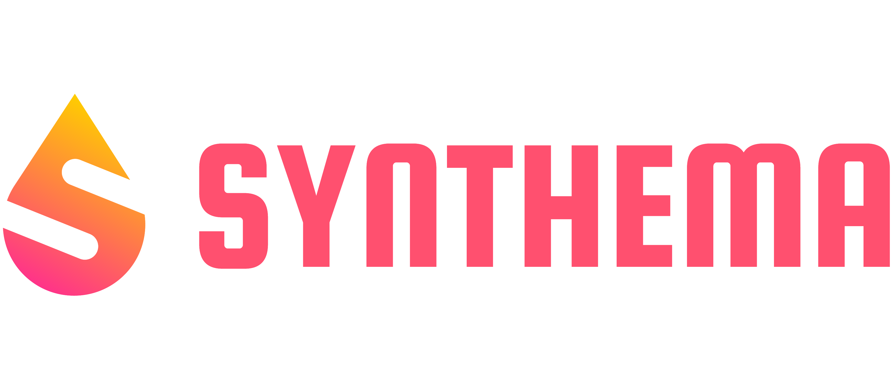

# SYNTHEMA Project

## Project Information

SYNTHEMA aims to establish a cross-border health data hub for RHDs where to develop and validate
innovative AI-based techniques for clinical data anonymisation and synthetic data generation (SDG), to
tackle the scarcity and fragmentation of data and widen the basis for GDPR-compliant research in RHDs.
The platform will be based on a privacy-preserving federated learning (FL) network, equipped with secure
multi-party computation (SMPC) protocols and differential privacy (DP), connecting health data centres,
academic research centres, industries and SMEs to advance translational and clinical research and care in RHDs.

* Project Number: 101095530
* Project name: Synthetic generation of hematological data over federated computing frameworks
* Project acronym: SYNTHEMA
* Call: HORIZON-HLTH-2022-IND-13
* Topic: HORIZON-HLTH-2022-IND-13-02
* Type of action: HORIZON-RIA
* Service: HADEA/A/03
* Project starting date: fixed date: 1 December 2022
* Project duration: 48 months

## Social Media and Website

* [Website](https://synthema.eu/)
* [Twitter](https://twitter.com/synthema_eu)
* [LinkedIn](https://www.linkedin.com/company/synthema/)
